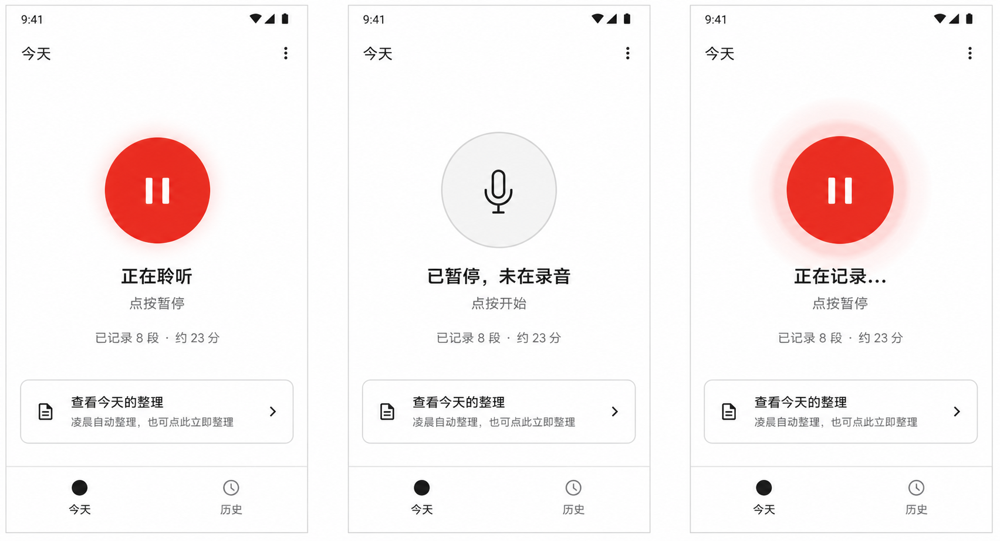
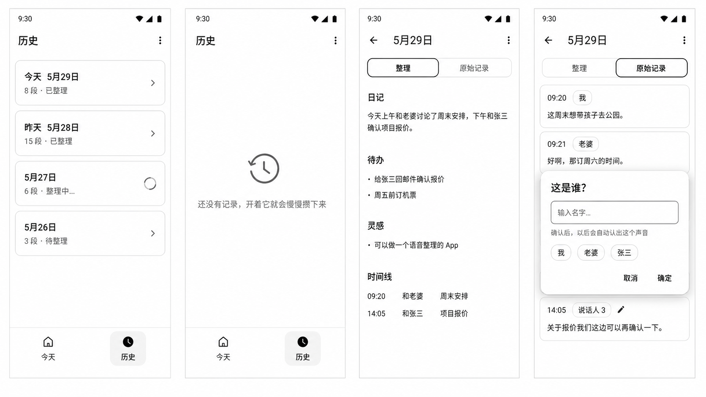
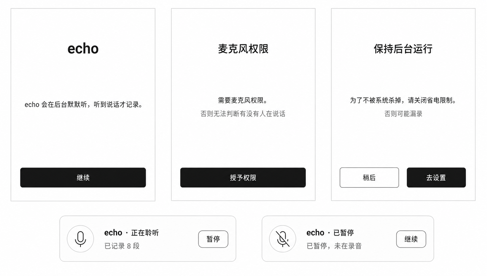

# echo · UI 设计文档

> 状态：🚧 待贰玖确认 → 交付 UI 出图
> 最后更新：2026-05-29
> 配套阅读：`docs/product/core/requirements.md`

## 0. 这份文档怎么用

这份文档是 echo 视觉与交互的**唯一真相来源**，同时服务两个角色：

- **UI 设计师**：照着每屏的布局、间距、字号、组件出高保真图。
- **coding agent**：照着 token 和组件清单实现，**不做任何审美决策**。

所以本文档刻意写得"过度具体"——把颜色、间距、字号、圆角全部定死。**凡是文档没说的，一律用 Material Design 3 默认值，不要发挥。**

---

## 1. 设计总纲：极简的三条铁律

1. **一屏只讲一件事**：每个界面有且只有一个主要任务，多余信息一律砍掉。
2. **能用系统默认就不自定义**：颜色、组件、动画全部走 Material Design 3 (M3) 原生，禁止自绘、禁止渐变、禁止阴影手调。
3. **后台为主，前台极轻**：App 大部分时间在后台干活，前台界面是"偶尔来看一眼"，不堆功能、不做仪表盘。

> 为什么这么严？因为代码由 coding agent 写，AI 审美弱。把所有审美决策前置成"查表"，AI 只需翻译，不需创造，出错率最低。

---

## 2. 设计 Token（定死，不许改）

### 2.1 配色

**基调：黑白极简 + 唯一一抹红。** 全 App 只有中性灰阶 + 一个红色用于录音指示，这抹红是整个 App 唯一的彩色，克制且是视觉焦点。深色主题用 M3 自动反色，不单独设计。

| 角色 | 浅色取值 | 用途 |
|------|---------|------|
| Primary（主色） | 近黑 `#1A1A1A` | 主开关、关键按钮、强调 |
| 背景 Surface | 纯白 `#FFFFFF` | 页面背景 |
| 次级背景 | 极浅灰 `#F5F5F5` | 卡片/分区底色 |
| 文字 OnSurface | 近黑 `#1A1A1A` | 主要文字 |
| 次要文字 | 中灰 `#6B6B6B` | 辅助说明、时间戳 |
| 分隔/边框 Outline | 浅灰 `#E0E0E0` | 卡片描边、分隔线 |
| **录音指示色（唯一彩色）** | 红 `#E5392F` | 仅用于"正在录音"圆点 + 呼吸动画 |

- 全程**只用上面这套中性灰阶**，红色**只允许出现在录音状态圆点**，别处一律不准用彩色。
- 按钮、图标、强调全部用近黑 `#1A1A1A`，靠粗细/留白做层次，不靠颜色。
- 深色模式：白底翻成近黑底、文字翻白，红色保持不变（深色底上更醒目）。用 M3 dynamic color 自动生成，开发不手配第二套。

### 2.2 字号（用 M3 Type Scale，不自定义字号）

| 用途 | M3 角色 | 字号/字重 |
|------|---------|----------|
| 页面大标题（如"今天"） | Headline Small | 24sp / Regular |
| 卡片/分区标题 | Title Medium | 16sp / Medium |
| 正文（转写、整理内容） | Body Large | 16sp / Regular |
| 辅助说明、时间戳 | Body Medium | 14sp / Regular |
| 标签、说话人名 | Label Large | 14sp / Medium |

字体直接用系统默认（Roboto / 思源黑体随系统），**不嵌入自定义字体**。

### 2.3 间距（8dp 栅格，只用这几档）

```
页面左右边距：     16dp
卡片内边距：       16dp
区块之间纵向间距： 24dp
同区块元素间距：   8dp 或 12dp
列表项高度：       最小 56dp（可点区域）
```

只允许出现 `4 / 8 / 12 / 16 / 24 / 32` 这几个间距值，禁止 13dp、17dp 这种随手值。

### 2.4 形状与高度

- 圆角：卡片和按钮统一 **12dp**（M3 Medium）。
- 高度/阴影：一律用 M3 组件默认 elevation，**禁止手动加阴影**。
- 不使用任何自定义图形、装饰线条、插画（除空状态用一个系统图标）。

### 2.5 图标

- 全部用 **Material Symbols（Outlined 风格）** 标准图标库，禁止自绘 SVG。
- 常用图标：`mic`（录音）、`pause`（暂停）、`history`（历史）、`today`（今天）、`person`（说话人）、`edit`（认领改名）。

---

## 3. 组件清单（只准用这些 M3 原生组件）

| 场景 | 用的组件 | 说明 |
|------|---------|------|
| 底部导航 | `NavigationBar`（2 个目的地） | 今天 / 历史 |
| 主录音开关 | 大号 `FilledButton` 或 M3 `FAB`（见 §4.1 二选一） | 全屏唯一主操作 |
| 卡片容器 | `Card`（Outlined 变体） | 整理结果、列表项 |
| 列表 | `ListItem` | 历史按天、转写按段 |
| 说话人标签 | `AssistChip` / `InputChip` | 显示+认领 |
| 顶部栏 | `TopAppBar`（Small 变体） | 页面标题 |
| 弹窗（认领改名） | `AlertDialog` + `TextField` | 输入说话人名字 |
| 加载 | `CircularProgressIndicator` | 整理中/转写中 |
| 空状态 | 居中图标 + 一行字 | 见 §7 |

> 清单之外的组件不要引入。需要新交互先回来更新这份文档。

---

## 4. 逐屏设计

全 App 共 **3 个界面 + 1 个通知 + 1 个弹窗**。底部 2 Tab：今天 / 历史。

### 4.1 界面①「今天」主页（打开 App 第一眼）

这是 App 的门面，任务只有一个：**让你一眼知道"它在不在听"，并能一键开关。**

```
┌─────────────────────────────┐
│  今天                        │ ← TopAppBar, Headline Small
│                             │
│                             │
│                             │
│          ●                  │ ← 录音状态圆形主控（可点击）
│       正在聆听               │ ← Title Medium
│       点按暂停               │ ← Body Medium, 次要文字
│                             │
│      已记录 8 段 · 约 23 分   │ ← Body Medium, 次要文字
│                             │
│                             │
│   ┌───────────────────────┐ │
│   │ 📄 查看今天的整理        │ │ ← Outlined Card, 整宽
│   │    凌晨自动整理 / 点此立即│ │
│   └───────────────────────┘ │
│                             │
├─────────────────────────────┤
│     ◉ 今天        ○ 历史     │ ← NavigationBar
└─────────────────────────────┘
```

**核心元素：状态大圆 + 一句话状态**
- 居中一个圆形主控（直径约 104dp），是整个 App 的视觉焦点，**同时承担开始/暂停录音的按钮功能**。
- 圆内只放一个 Material Symbols 图标：聆听/记录中显示 `pause`，暂停态显示 `mic` 或 `play_arrow`。不再单独放一个横向按钮。
- 三种状态，靠颜色 + 文字区分，不靠动画堆砌：

| 状态 | 圆颜色 | 文字 | 圆形主控点击动作 |
|------|--------|------|------|
| 正在聆听 | 红 `#E5392F` + 缓慢呼吸 | 正在聆听 | 暂停聆听 |
| 已暂停 | 浅灰 `#E0E0E0` 静态 | 已暂停，未在录音 | 开始聆听 |
| 检测到人声（录入中） | 红 `#E5392F` + 呼吸加快 | 正在记录… | 暂停聆听 |

> **呼吸动画（已确认要做）**：聆听态下红圆做 alpha + scale 的缓慢呼吸（约 2~3 秒一个循环，透明度在 0.6~1.0、缩放在 0.96~1.04 之间往复）；检测到人声时呼吸节奏加快（约 1 秒一循环），给一个"它真的捕捉到了"的反馈。用 Compose 的 `rememberInfiniteTransition` + `animateFloat` 实现，**不要自写帧动画或 Canvas**。暂停态圆静止不呼吸。

- "已记录 N 段 · 约 X 分"是当天累计，给你一个"它真的在干活"的安心感。
- 状态文字下方可用一行灰字提示当前点击动作：`点按暂停` / `点按开始`。这行是辅助说明，不是按钮。
- 底部一张卡片直通今天的整理结果；附一行小字说明"凌晨自动整理，也可点此立即整理"。

### 4.2 界面②「历史」按天列表

任务：**按天往回翻。** 一个朴素的列表，不做日历、不做图表。

```
┌─────────────────────────────┐
│  历史                        │ ← TopAppBar
│                             │
│  ┌─────────────────────────┐│
│  │ 今天 5月29日             ││ ← ListItem
│  │ 8 段 · 已整理            ││   主文字 + 次要文字
│  └─────────────────────────┘│
│  ┌─────────────────────────┐│
│  │ 昨天 5月28日             ││
│  │ 15 段 · 已整理           ││
│  └─────────────────────────┘│
│  ┌─────────────────────────┐│
│  │ 5月27日                 ││
│  │ 6 段 · 已整理            ││
│  └─────────────────────────┘│
│           ...               │
│                             │
├─────────────────────────────┤
│     ○ 今天        ◉ 历史     │
└─────────────────────────────┘
```

- 每行一天：主文字是日期（今天/昨天用相对词），次要文字是"N 段 · 整理状态"。
- 整理状态三种文案：`已整理` / `整理中…`（配小转圈）/ `待整理`。
- 点任意一行 → 进当天详情。
- 倒序排列，最近的在最上。无分页花样，普通滚动列表。

### 4.3 界面③ 当天详情

任务：**看 AI 整理出了什么 + 翻原始记录 + 认领说话人。** 这是信息最多的一屏，用上下两段分明的结构压住复杂度。

```
┌─────────────────────────────┐
│ ←  5月29日                   │ ← TopAppBar 带返回
│                             │
│  ┌── 分段切换 ──────────────┐│
│  │ [ 整理 ]   原始记录       ││ ← M3 Tab / SegmentedButton
│  └─────────────────────────┘│
│                             │
│ === 「整理」页 ===           │
│  日记                        │ ← Title Medium 分区标题
│  今天上午和老婆讨论了周末...   │ ← Body Large
│                             │
│  待办                        │
│  • 给张三回邮件确认报价        │
│  • 周五前订机票               │
│                             │
│  灵感                        │
│  • 可以做一个语音整理的 App    │
│                             │
│  时间线                      │
│  09:20  和老婆  周末安排       │
│  14:05  和张三  项目报价       │
│                             │
├─────────────────────────────┤
│ (无底部导航，这是二级页)       │
└─────────────────────────────┘
```

**两个分段（用 M3 SegmentedButton 或 Tab 切换）：**

**A.「整理」页** — 默认页，四个分区固定顺序：日记 → 待办 → 灵感 → 时间线
- 每个分区一个 Title Medium 标题 + 内容。
- 待办/灵感用项目符号列表；时间线用"时间 + 谁 + 主题"三段式。
- 某分区当天无内容就**整段不显示**，不留空标题。

**B.「原始记录」页** — 按时间顺序的转写片段：

```
┌─────────────────────────────┐
│ [整理]   「原始记录」         │
│                             │
│  ┌─────────────────────────┐│
│  │ 09:20  [我]              ││ ← AssistChip 显示说话人
│  │ 这周末想带孩子去...        ││ ← Body Large 转写文字
│  └─────────────────────────┘│
│  ┌─────────────────────────┐│
│  │ 09:21  [老婆]            ││
│  │ 好啊，那订周六的...        ││
│  └─────────────────────────┘│
│  ┌─────────────────────────┐│
│  │ 14:05  [说话人 3]  ✎     ││ ← 未认领，chip 可点改名
│  │ 关于报价我们这边...        ││
│  └─────────────────────────┘│
│                             │
└─────────────────────────────┘
```

- 每段一张 Outlined Card：顶部「时间 + 说话人 Chip」，下面转写文字。
- **说话人 Chip 即认领入口**：
  - 已认领（我/老婆）：实心 InputChip，显示名字。
  - 未认领（说话人 N）：带 ✎ 图标的 AssistChip，**点它弹出认领弹窗**。

### 4.4 认领弹窗（AlertDialog）

点未认领的说话人 Chip 时弹出，是 echo 声纹认领的唯一交互入口：

```
┌───────────────────────┐
│  这是谁？               │ ← AlertDialog 标题
│                       │
│  ┌───────────────────┐│
│  │ 输入名字…          ││ ← TextField
│  └───────────────────┘│
│                       │
│  常用：[我][老婆][张三] │ ← 已有声纹的 AssistChip 快选
│                       │
│        取消    确定     │ ← TextButton x2
└───────────────────────┘
```

- 输入框 + 已注册联系人快选 Chip（点一下直接填）。
- 确定后：这段音频入声纹库，当天**所有同一 Speaker 编号的片段一起回填**成该名字，以后自动认。
- 文案提示一行小字：「确认后，以后会自动认出这个声音」。

### 4.5 常驻通知（前台 Service 必须）

App 录音时系统通知栏常驻一条，Android 强制要求，也是隐私可见性的体现：

```
┌─────────────────────────────┐
│ 🎙 echo · 正在聆听            │
│ 已记录 8 段                   │
│           [ 暂停 ]           │ ← 通知 Action 按钮
└─────────────────────────────┘
```

- 标题随状态变：`正在聆听` / `已暂停`。
- 一个 Action 按钮：聆听中显示「暂停」，暂停时显示「继续」。
- 暂停态通知不可滑掉（前台 Service 限制），文案明确告诉用户"已暂停，未在录音"。

---

## 5. 首次启动引导（一次性，越短越好）

第一次装好打开时，要拿到两个东西才能干活：**麦克风权限** + **电池白名单**（对抗杀后台）。用最少的页面讲清楚：

```
引导页 1：echo 会在后台默默听，听到说话才记录。   [继续]
引导页 2：需要麦克风权限。                      [授予权限]
引导页 3：为了不被系统杀掉，请关闭省电限制。      [去设置] [稍后]
```

- 三页全屏单列，每页一句话 + 一个按钮，**不放插画、不放多段说明**。
- 电池白名单这步给一个直达系统设置的按钮 + 一句"否则可能漏录"的提醒。
- 引导只走一次，之后不再出现。

---

## 6. 状态与边界文案（统一在此定，避免 AI 自由发挥）

| 场景 | 文案 |
|------|------|
| 正在录音 | 正在聆听 |
| 检测到说话 | 正在记录… |
| 已暂停 | 已暂停，未在录音 |
| 今天还没整理 | 凌晨自动整理，也可点此立即整理 |
| 正在整理 | 正在整理今天… |
| 转写中 | 转写中… |
| 认领提示 | 确认后，以后会自动认出这个声音 |

文案统一**简短、口语、不用感叹号**。

---

## 7. 空状态（每个列表都要有，AI 常漏）

| 界面 | 空状态 | 图标 |
|------|--------|------|
| 历史无任何记录 | 居中：「还没有记录，开着它就会慢慢攒下来」 | `history` |
| 当天无转写 | 「今天还没听到说话」 | `mic_off` |
| 整理结果某分区为空 | 整段隐藏，不显示空标题 | — |

空状态统一：居中一个灰色系统图标（48dp）+ 一行 Body Medium 灰字，不放按钮、不放插画。

---

## 8. 给 UI 设计师的交付清单

请按此清单出高保真图（浅色为主，深色可选）：

1. 界面①「今天」主页 ×3 态（聆听 / 暂停 / 记录中）
2. 界面②「历史」列表（有数据 + 空状态）
3. 界面③ 当天详情 -「整理」页
4. 界面③ 当天详情 -「原始记录」页（含已认领 + 未认领 chip）
5. 认领弹窗
6. 常驻通知 ×2 态（聆听 / 暂停）
7. 首启引导 3 页

**出图请严格遵守 §2 的 Token**：黑白极简（中性灰阶）、近黑 `#1A1A1A` 作主色、红 `#E5392F` 仅用于录音指示圆点、8dp 栅格、12dp 圆角、Material Symbols Outlined 图标。**全 App 只有这一抹红是彩色，别处不要出现任何彩色；不要自由发挥配色、阴影、插画。**

---

## 9. 已生成 UI 图

以下为 2026-05-29 生成并确认保留的 UI 设计板，后续实现以这些图和上文规格共同为准。

### 9.1 今天主页 3 态



### 9.2 历史 / 详情 / 认领弹窗



### 9.3 首启引导 / 常驻通知



---

## 10. 给 coding agent 的实现备注

- 技术栈：Android 原生 Kotlin + **Jetbrains Compose + Material 3 库**（`androidx.compose.material3`）。
- 所有颜色走 `MaterialTheme.colorScheme`，所有字号走 `MaterialTheme.typography`，**不要写死 hex/sp**（§2 的取值是给设计对齐用的，代码里用 M3 语义角色）。
- 间距用 §2.3 的固定档位，封装成常量，不散落魔法数字。
- 动画：**仅录音状态圆点的呼吸动画要做**（见 §4.1），用 Compose `rememberInfiniteTransition` 实现；除此之外不加任何自定义动画，页面切换用 M3 默认过渡。
- 这份文档没规定的视觉细节 → 用 M3 默认值，**不要创造**。

---

## 已确认（2026-05-29 贰玖拍板）

1. **主色基调：黑白极简** —— 否决紫色（觉得 low）。全 App 中性灰阶 + 唯一一抹红 `#E5392F` 仅用于录音指示。
2. **录音状态圆要呼吸动画** —— 聆听缓慢呼吸、检测到人声加快，见 §4.1。
3. **3 屏结构通过** —— 今天 / 历史 / 详情，交互确认 OK，可交付 UI 出图。
